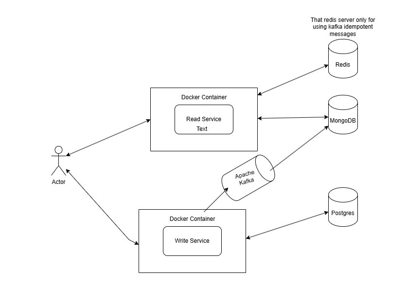

# Domain-Driven Design with CQRS: E-Commerce Extension Service

## Purpose

This project serves as a practical implementation of **Domain-Driven Design (DDD)** and **Command Query Responsibility Segregation (CQRS)** patterns. It is developed as an independent service that extends the functionality of an [existing e-commerce application](https://github.com/jenkem1337/e-commarce) while remaining decoupled and modular. 

The key goals of the project include:

- **Decoupled Integration**: Functionality can be added to the e-commerce system without creating tight dependencies.
- **CQRS for Scalability**: Separation of write and read models for better scalability and performance.
- **Event-Driven Architecture**: Utilize Apache Kafka for asynchronous event communication.
- **Real-world DDD Concepts**: Implement domain models, aggregates, and bounded contexts to demonstrate the practical use of DDD principles.

This project is both a learning exercise and a foundational prototype for building scalable, modular, and maintainable services.

---

## Technologies Used

The following technologies and tools are used in this project:

- **Programming Language**: TypeScript
- **Framework**: NestJS
- **ORM**: TypeORM
- **Databases**:
  - PostgreSQL (for transactional and write operations)
  - MongoDB (for read-optimized views and projections)
- **Caching**: Redis (for providing Apache Kafka event idempotency )
- **Message Broker**: Apache Kafka (for event streaming and asynchronous communication)
- **Containerization**: Docker (for consistent deployment across environments)

---

## High-Level Architecture

The high-level architecture diagram below illustrates the separation of the write and read models, along with the event-driven communication flow:

